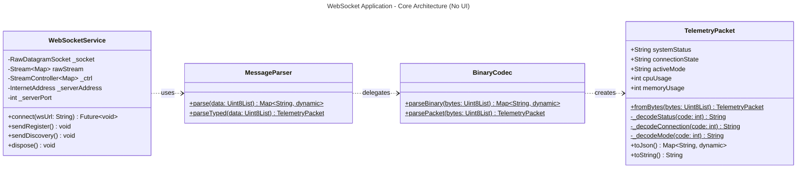

# UML Class Diagram - WebSocket Application Architecture

## Relationship Legend

| Symbol | Meaning | Description |
|--------|---------|-------------|
| `*--` | Composition | Strong ownership (part cannot exist without whole) |
| `o--` | Aggregation | Weak ownership (part can exist independently) |
| `-->` | Association | General relationship |
| `..>` | Dependency | Uses without ownership |
| `--|>` | Inheritance | "is a" relationship |
| `..\|>` | Realization | Implements interface |

## Architecture Flow

1. **WebSocketService** receives UDP packets via **RawDatagramSocket**
2. Raw bytes are passed to **MessageParser.parse()**
3. **MessageParser** delegates to **BinaryCodec.parseBinary()**
4. **BinaryCodec** creates **TelemetryPacket** instances
5. **TelemetryPacket.fromBytes()** uses **ByteData** for structured parsing
6. Parsed data flows through **StreamController** to subscribers

## Key Design Patterns

- **Facade Pattern**: WebSocketService provides simple interface to complex UDP operations
- **Factory Pattern**: TelemetryPacket.fromBytes()
- **Static Utility**: MessageParser and BinaryCodec use static methods
- **Observer Pattern**: StreamController for reactive data flow

## Notes

- UI components (HomeScreen, DataView, MyApp) are intentionally excluded
- All parsing logic is encapsulated in model and codec layers
- Type-safe through TelemetryPacket model
- Clean separation between transport (WebSocketService) and parsing (BinaryCodec)
